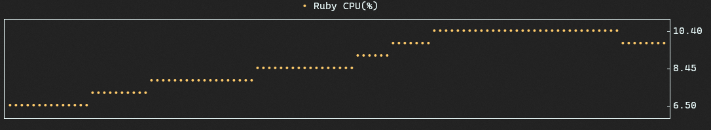

# Termplot

Termplot is a simple terminal plotting tool for visualising streaming data.

See the demo on Asciinema:

[](https://asciinema.org/a/3rzeUSXp2fRjnErX0p3SptP5e)

## Overview

Termplot draws trendlines of data piped into the command from standard input.
It's handy for quickly visualising streaming data in your terminal and works
with any numeric data you can pipe into stdin.

## Installation

The tool is a ruby gem and can be installed with:

    $ gem install termplot

## Usage

The basic usage is simple:

```
{command} | termplot [OPTIONS]
```

`{command}` is any command that will periodically output numbers to standard out
delimited by a newline. Options and examples are given below. All command line
options are optional.

Options:

```
Usage: termplot [OPTIONS]
  -r, --rows ROWS         Number of rows in the chart window (default: 19)
  -c, --cols COLS         Number of cols in the chart window (default: 80)
  -t, --title TITLE       Title of the series (default: Series)

      --line-style STYLE  Line style. Options are:
                            line [default], heavy-line, dot, star, x

      --color COLOR       Series color, specified as ansi 16-bit color name:
                            (i.e. black, red [default], green, yellow, blue,
                            magenta, cyan, white). Light versions are specified
                            as light_{color}

  -h, --help              Display this help message
```

## Examples

Sine wave:

```
for i in $(seq 500); do \
  echo $i | awk '{ print sin($0/10) }'; \
  sleep 0.5; \
  done | termplot -t "Sin(x)"
```


Total % memory usage:
```
while true; do \
  free | awk 'NR==2 { print ($3/$2) * 100 }'; \
  sleep 0.5; \
  done | termplot -t "Memory (% used)" --color light_magenta --line-style heavy-line
```


% CPU usage of a "puma" process:
```
while true; do \
  ps au | grep puma | awk 'NR==1{ print $3 }'; \
  sleep 0.5; \
  done | termplot -t "Ruby CPU(%)" --color yellow --line-style dot -r10 -c 120
```



## Notes

- The command should work just fine if you have a monospaced unicode font.
  Tested on linux, and should work on MacOS too. Not too sure about windows.
- The samples received are plotted in sequence order, and there is no notion of
  temporal spacing. So even if the time between samples is inconsistent, they
  will be plotted with the same amount of space between them.
- The `while true; do {...}; sleep INTERVAL` is pretty typical, I would like to
  sometime soon implement a `--command "{...}" --interval INTERVAL` which would
  reduce some of the boilerplate of calling some command at an interval and make
  it easy to watch and plot.

## Background

I recently needed to be able to monitor the number of open TCP connections on my
linux machine. I could get the data I needed from `ss` with some text processing
but I didn't have a quick and easy way to eyeball the overall trend.

I mainly work with ruby, so taking
inspiration from fantastic libraries like [Unicode Plots
(Julia)](https://github.com/Evizero/UnicodePlots.jl) and
[Termeter (Go)](https://github.com/atsaki/termeter), I decided to build something in
ruby.

Now with termplot, it's as easy as:

```
while true; do \
  ss -s | head -n1 | cut -d ' ' -f2; sleep 1; \
  done | termplot -t "TCP Connections"
```


## Development

After checking out the repo, run `bin/setup` to install dependencies. There are
some simple test commands in the Rakefile which are useful for development. To
install this gem onto your local machine, run `bundle exec rake install`.

## Contributing

Bug reports and pull requests are welcome on GitHub at
https://github.com/Martin-Nyaga/termplot.

## License

The gem is available as open source under the terms of the [MIT
License](https://opensource.org/licenses/MIT).
