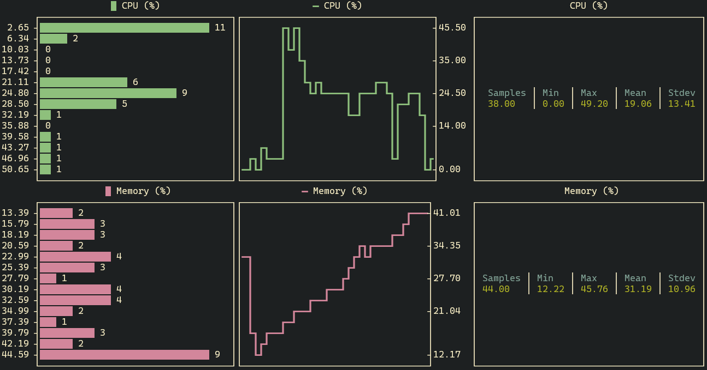
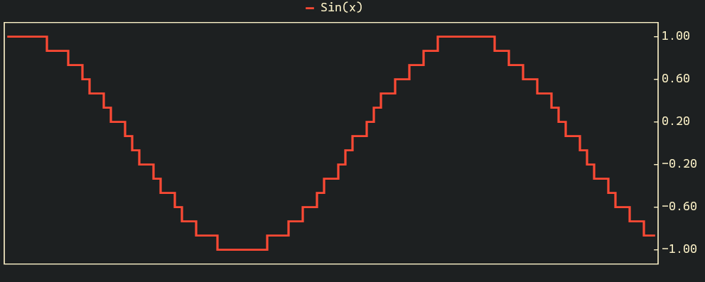
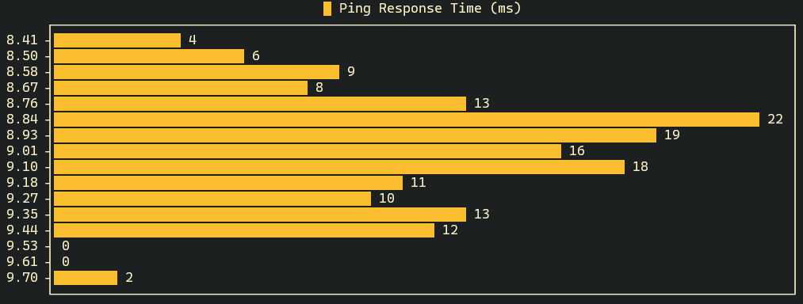
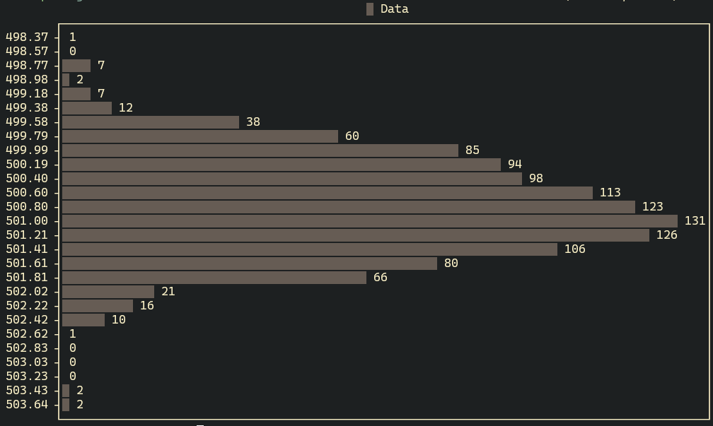
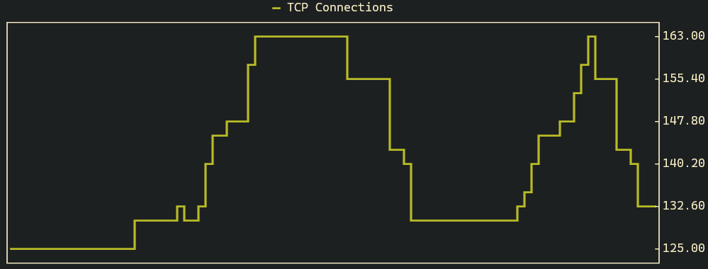
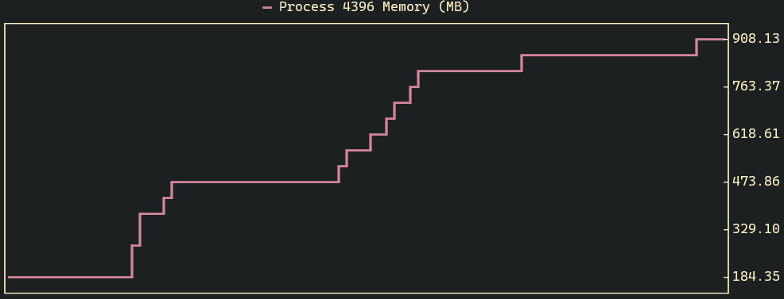
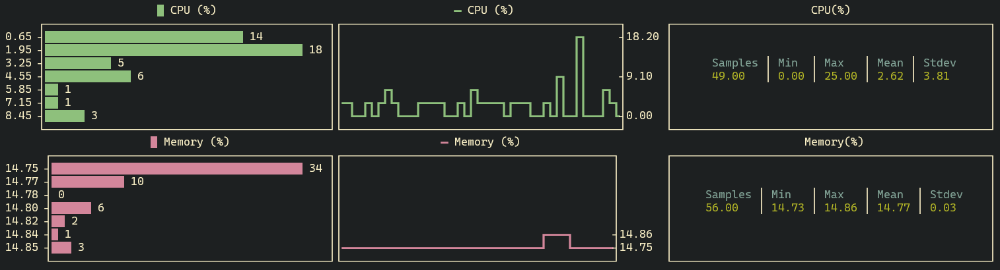

# Termplot

[](https://badge.fury.io/rb/termplot)

Termplot is a simple terminal plotting tool for visualising streaming data.



## Overview

Termplot draws live plots of data in your terminal. It's handy for quickly
visualising streaming data and works with any numeric data you can pipe into
stdin or otherwise obtain by running a shell command.

## Installation

The tool is a ruby gem and can be installed with:

    $ gem install termplot

## Usage

There are 3 ways to provide input to termplot:
- **Stdin:** Pipe data into standard input
- **Command:** Specify a command to be ran at an interval
- **Configuration file:** Read a multi-chart configuration from a file

### Pipe data into standard input
```
COMMAND | termplot [OPTIONS]
```

`COMMAND` is any command that will periodically output numbers to standard out
delimited by a newline. These will be consumed by termplot and drawn to a chart. 

You can specify the following options (all are optional):
```
    -r, --rows ROWS           Number of rows in the chart window (default: 19)
    -c, --cols COLS           Number of cols in the chart window (default: 100)
        --full-screen         Render to the full available terminal size

        --type TYPE           The type of chart to render.
                              Options are: timeseries (default), stats, hist

        --timeseries          Shorthand for --type timeseries
        --stats               Shorthand for --type stats
        --hist                Shorthand for --type hist

    -t, --title TITLE         Title of the series (default: 'Series')
        --color COLOR         Series color, specified as ansi 16-bit color name:
                              (i.e. black, light_black, red, light_red,
                              green (default), light_green, yellow,
                              light_yellow, blue, light_blue, magenta,
                              light_magenta, cyan, light_cyan, white,
                              light_white, default)

        --line-style STYLE    Line style.
                              Options are: line, heavy-line (default), dot, star, x, bar
```

#### Examples

##### Plot a sine wave from standard in:

```
for i in $(seq 500); do \
  echo $i | awk '{ print sin($0/10) }'; \
  sleep 0.5; \
  done | termplot -t "Sin(x)" --color red
```


##### Plot histogram of network times as reported by `ping`:
```
ping example.com |
  awk '{ split($8,arr,"="); print arr[2]; fflush("/dev/stdout") }' |
  termplot -t "Ping Response Times (ms)" --hist
```


##### Plot histogram of data from column 33 of a CSV file:
```
cat file.csv | cut -d, -f33 | tail -n +2 |
  termplot -- --hist -r30 -t "Data" --color light_black
```



### Run command at an interval
To run a command at an interval, specify `--command`, and optionally
`--interval` to termplot:
```
termplot --command 'COMMAND' --interval INTERVAL [OPTIONS]
```

`COMMAND` will be invoked at the specified interval in milliseconds (default:
1000) and its output will be used as the data for the chart. You can specify all
the same additional options as in stdin mode above.

#### Examples
##### Plot number of TCP connections over time:

```
termplot --command 'ss -s | head -n1 | cut -d" " -f2' \
  --interval 500 -t "TCP Connections"
```


##### Plot memory usage of process with PID 4396:

```
termplot --command "ps -q 4396 -o rss= | awk '{ print (\$0/1024.0) }'" \
  -t "Process 4396 Memory (MB)" --color light_magenta
```


### Specify a multi-chart configuration 
You can configure termplot to set up a multi-chart dashboard using a ruby
configuration file:

```
termplot [--file/-f] FILE
```

The configuration file uses a simple ruby DSL to arrange charts into rows and
columns. Each chart will take a command and optionally an interval as well as
formatting options. Termplot will then run the command at the specified interval
and render the resulting data into the charts.

#### Example

File (sample.rb):
```ruby
col do
  row do
    cpu_command =
      "top -b -n 1 | awk -F',' 'NR==3{ split($4, arr, \" \"); print 100.0 - arr[1] }'"

    histogram  title: "CPU (%)", command: cpu_command, color: "light_cyan"
    timeseries title: "CPU (%)", command: cpu_command, color: "light_cyan"
    statistics title: "CPU (%)", command: cpu_command
  end

  row do
    memory_command = "free | awk 'NR==2 { print ($3/$2) * 100 }'"

    histogram  title: "Memory (%)", command: memory_command, color: "light_magenta"
    timeseries title: "Memory (%)", command: memory_command, color: "light_magenta"
    statistics title: "Memory (%)", command: memory_command
  end
end
```
Run it with:
```
termplot -f sample.rb --cols 150 --rows 20
```

Result: 



## Notes

- Termplot should work just fine if you have a monospaced unicode font.
  Tested on linux, and should work on MacOS too. Not too sure about windows.
- On timeseries plots, samples received are plotted in sequence order, and there
  is no notion of temporal spacing. So even if the time between samples is
  inconsistent, they will be plotted with the same amount of space between them.

## Background 

A while back I needed to be able to monitor the number of open TCP connections
on my linux machine. I could get the data I needed from `ss` with some text
processing but I didn't have a quick and easy way to eyeball the overall trend.

I mainly work with ruby, so taking
inspiration from fantastic libraries like [Unicode Plots
(Julia)](https://github.com/Evizero/UnicodePlots.jl) and
[Termeter (Go)](https://github.com/atsaki/termeter), I decided to build something in
ruby.

Now with termplot, it's as easy as:

```
termplot --command 'ss -s | head -n1 | cut -d" " -f2' --interval 500 -t "TCP Connections"
```


In the end termplot turned out to be useful for all sorts of command line
visualisation tasks.

## Development

After checking out the repo, run `bin/setup` to install dependencies. There are
some simple test commands in the Rakefile which are useful for development. To
install this gem onto your local machine, run `bundle exec rake install`.

## Contributing

Bug reports and pull requests are welcome on GitHub at
https://github.com/Martin-Nyaga/termplot.

## License

The gem is available as open source under the terms of the [MIT
License](https://opensource.org/licenses/MIT).
